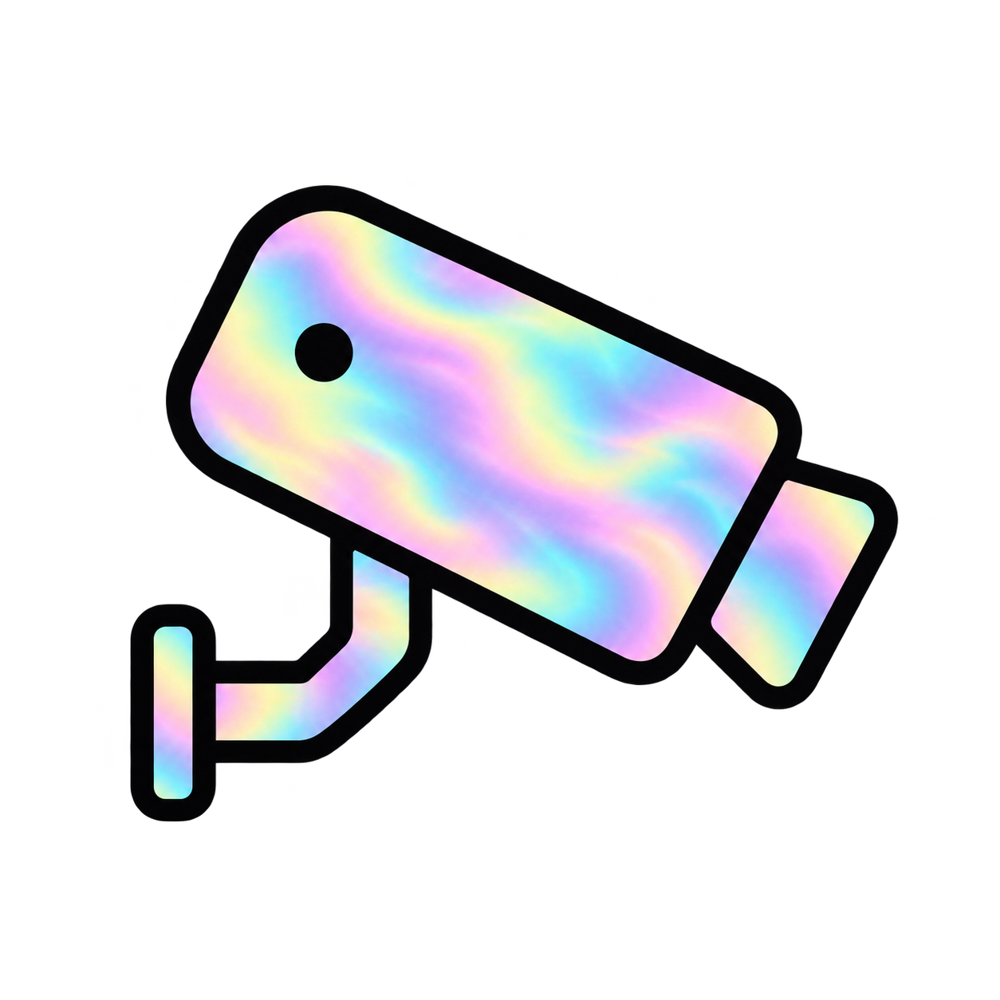
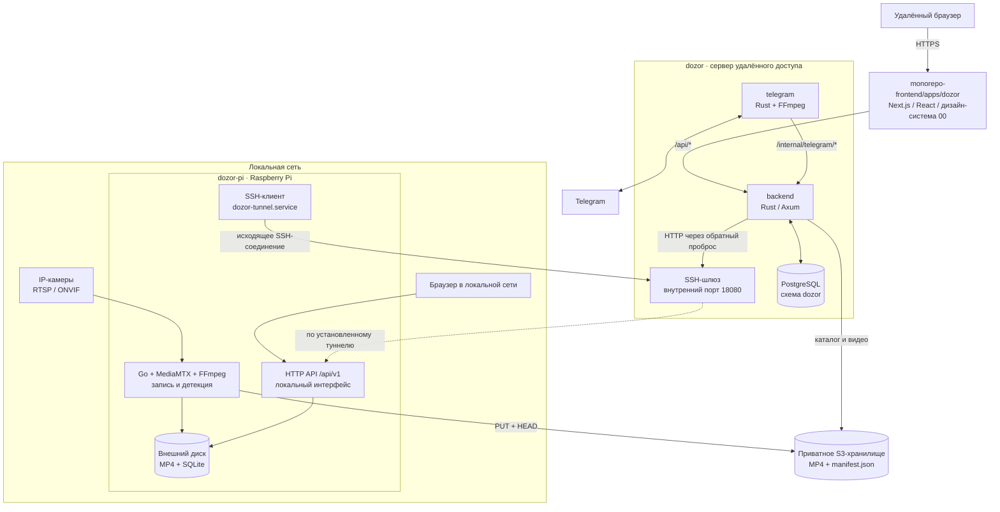
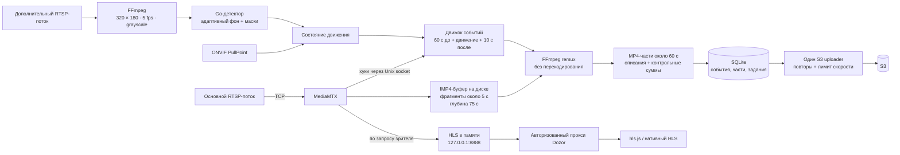
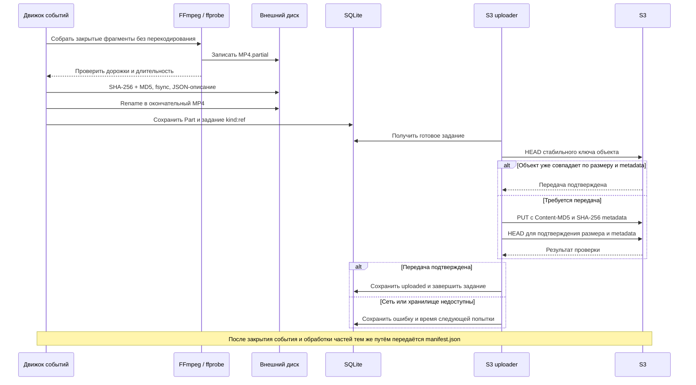
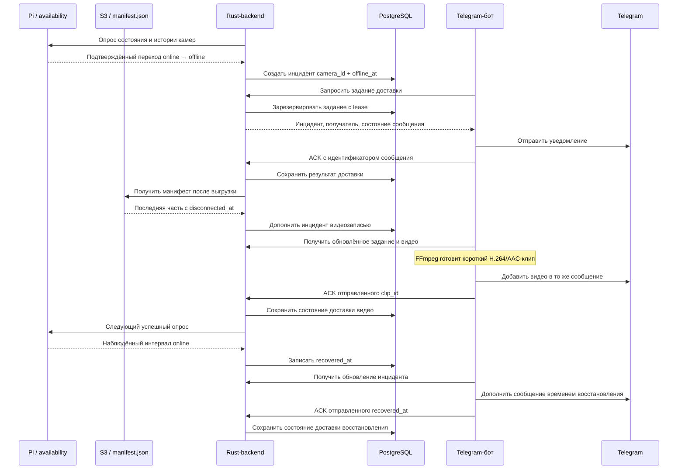
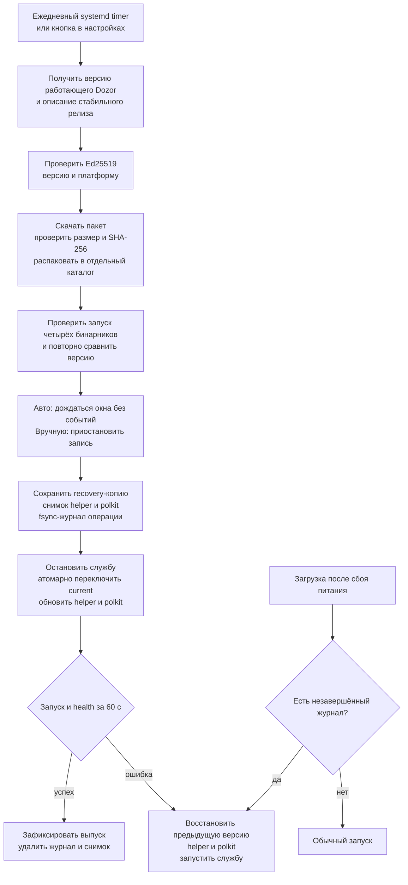

# Dozor



**Локальный видеоархив на Raspberry Pi с записью по движению, предысторией, прямым эфиром и резервным копированием в S3.**

Dozor постоянно принимает RTSP-потоки камер и держит короткий буфер на внешнем диске. При движении он сохраняет до **60 секунд до события**, само событие и **10 секунд после**, собирает независимые MP4-части и отправляет их в S3. Запись и локальный интерфейс работают автономно; удалённый кабинет и Telegram-бот дополняют систему просмотром облачного архива и уведомлениями об отключении камер.

Целевая платформа — **Raspberry Pi 4 / Raspberry Pi OS Lite 64-bit**, внешний диск ext4 или exFAT и IP-камеры с RTSP. Интерфейс на русском, адаптирован для компьютера и телефона. Основной поток сохраняется без перекодирования.

[Архитектура](#архитектура-системы) · [Запись](#запись-и-обработка-видео) · [Хранение](#хранение-и-восстановление) · [S3](#резервное-копирование-в-s3) · [Удалённый доступ](#удалённый-кабинет-и-telegram) · [Установка](#установка-на-raspberry-pi) · [Разработка](#разработка)

## Возможности

- **Запись по движению:** ONVIF PullPoint, локальный детектор с адаптивным фоном, чувствительность и прямоугольные маски. При сбое детектора включается непрерывная запись до восстановления.
- **Архив событий:** MP4-части примерно по минуте, фильтры по камере и дате, просмотр с перемоткой через HTTP Range и скачивание. Готовые части доступны ещё до завершения длинного события.
- **Прямой эфир:** HLS из того же основного потока, звук, полноэкранный просмотр, возврат к текущему кадру и автоматическое переподключение.
- **История доступности:** общая временная шкала камер за последние 24 часа, сохранение наблюдений на диске и отметка последней записи перед отключением.
- **Управление диском:** выбор раздела по UUID, systemd/udev, автоматическое подключение вернувшегося USB-диска и очистка архива по заполнению.
- **Надёжная публикация:** временные файлы, контрольные суммы, синхронизация на диск, SQLite WAL и восстановление прерванных операций.
- **S3:** сохраняемая очередь, ограничение скорости, повторы, стабильные ключи объектов и подтверждение каждой передачи.
- **Подписанные обновления:** Ed25519, проверка пакета до остановки записи, атомарное переключение версии и автоматический откат приложения и системной интеграции.
- **Удалённый кабинет:** облачные и локальные записи, прямой эфир через исходящий SSH-туннель, история отключений и управление Telegram-подписками.

## Архитектура системы

Система разделена на устройство записи, сервер удалённого доступа и веб-клиент. Pi отвечает за получение и сохранение видео. Сервер объединяет архив S3 с API устройства и хранит состояние уведомлений в PostgreSQL. Браузер обращается к серверному прокси веб-клиента; пароли Pi и ключи S3 остаются на сервере.



Исходники распределены по трём каталогам. При совместной разработке они располагаются рядом, например внутри `~/coding/jourloy/`:

| Каталог | Назначение | Стек |
| --- | --- | --- |
| `dozor-pi/` — этот репозиторий | Запись, детекция, локальный архив, API, интерфейс устройства, S3 и обновления | Go, SQLite, MediaMTX, FFmpeg, systemd |
| `dozor/backend/` | API кабинета, чтение S3, доступ к Pi, мониторинг камер, сессии и очередь уведомлений | Rust, Axum, Tokio, PostgreSQL |
| `dozor/telegram/` | Подписки, доставка уведомлений, подготовка видеоклипов и обновление сообщений | Rust, Telegram Bot API, FFmpeg |
| `dozor/common/` | Общие структуры событий, манифестов и заданий доставки | Rust, Serde |
| `dozor/ops/` | SSH-шлюз сервера и служба исходящего туннеля на Pi | OpenSSH, Docker, systemd |
| `monorepo-frontend/apps/dozor/` | Удалённый кабинет: архив, эфир, отключения и уведомления | Next.js, React, TypeScript, hls.js, `@jourloy/00` |

Для локальной работы достаточно `dozor-pi`. Подключение S3, сервера и удалённого кабинета расширяет доступ к уже существующему архиву. Встроенный интерфейс Pi поставляется внутри Go-бинарника вместе со шрифтами, иконками и hls.js; Node.js и CDN устройству не нужны.

## Запись и обработка видео

Основной поток проходит через MediaMTX в кольцевой буфер на диске. Детектор работает независимо: получает события ONVIF либо анализирует дополнительный поток низкого разрешения. Движок событий связывает сигнал движения с временным окном видео и передаёт закрытые фрагменты сборщику MP4.



### Жизненный цикл события

1. MediaMTX непрерывно принимает основной поток и закрывает fMP4-фрагменты. Хуки регистрируют их в каталоге через Unix socket; периодическая сверка подхватывает файлы при пропущенном уведомлении.
2. Первое движение открывает событие с началом на 60 секунд раньше текущего времени. Фрагменты, нужные несобранному событию, закрепляются в буфере и сохраняются дольше обычных 75 секунд.
3. Пока движение продолжается, конец события сдвигается на 10 секунд вперёд. Повторное движение в этом интервале продлевает событие; после паузы начинается новое.
4. Примерно каждая минута доступного видео собирается в самостоятельную MP4-часть. Она сразу появляется в локальном архиве и очереди S3, даже если движение ещё продолжается.
5. После завершения окна записи движок оставляет 12 секунд на закрытие последнего фрагмента, собирает хвост и закрывает событие. S3 uploader публикует `manifest.json` после обработки частей.

Границы видео округляются наружу по доступным фрагментам и ключевым кадрам. Сразу после запуска буфер постепенно набирает глубину; событие с короткой предысторией получает отметку `short_prebuffer`. Предыстории соседних событий могут пересекаться.

При отключении камеры движок завершает событие из доступных фрагментов сразу после уведомления MediaMTX. Резервная проверка обнаруживает отсутствие свежих фрагментов за 20 секунд. Поздно закрывшийся последний фрагмент дополняет событие; `disconnected_at` отмечает событие и ровно одну заключительную часть. После возвращения камеры запись начинается отдельным событием.

### Детекция движения

| Режим | Источник движения | Поведение при сбое |
| --- | --- | --- |
| `auto` | ONVIF после получения фактических уведомлений; иначе локальный детектор | Переход на дополнительный поток; при ошибке детектора — непрерывная запись |
| `onvif` | ONVIF PullPoint камеры | Непрерывная запись до восстановления источника |
| `local` | Сравнение кадров дополнительного потока с адаптивным фоном | Непрерывная запись до восстановления детектора |

Локальный детектор обрабатывает кадры **320 × 180, 5 fps, grayscale**. Чувствительность регулируется в настройках камеры. Прямоугольные маски задаются долями кадра, например `[{"x":0,"y":0,"w":0.2,"h":0.3}]`; зоны ONVIF настраиваются в самой камере. Детектор реагирует на изменение изображения, включая освещение и осадки.

### Подключение камер и прямой эфир

В разделе **Камеры → Добавить камеру** задаются название, RTSP-адрес без учётных данных, логин и пароль отдельно. При включении камеры приложение получает характеристики основного и дополнительного потоков через ffprobe. **Поиск в сети** использует ONVIF WS-Discovery в текущем сетевом сегменте, получает профили камеры и позволяет назначить потоки. Для других сегментов сети доступно ручное добавление.

Профиль для просмотра в браузере — **H.264 + AAC** либо H.264 без звука. Совместимость потока с MP4 и браузером определяется исходными кодеками: автоматического перекодирования основного видео нет. Ключевой кадр раз в 1–2 секунды помогает держать короткие фрагменты и задержку эфира. Для локальной детекции и резервного режима `auto` используется дополнительный поток с низким разрешением и битрейтом.

Раздел **Онлайн** использует тот же основной поток, что и запись. MediaMTX создаёт HLS в памяти по запросу зрителя и освобождает его через 15 секунд без запросов. Внутренние RTSP- и HLS-порты слушают только loopback; каждый запрос браузера проходит авторизацию в API Dozor. Для эфира нужны включённая камера, подключённый архивный диск и работающая видеослужба.

Плеер поддерживает звук, полноэкранный режим, переключение камер, кнопку **К эфиру** и автоматическое переподключение. Уход из раздела, сворачивание вкладки или выход из аккаунта прекращают загрузку. Браузеры с MSE используют встроенный hls.js, остальные — нативный HLS. Задержка зависит от GOP камеры и буфера плеера.

## Хранение и восстановление

Конфигурация и секреты находятся на системном носителе. Каталог, буфер и видео — на выделенном внешнем разделе.

```text
/var/lib/dozor/
  config.json                    # настройки и секреты, 0600
  setup-token                    # одноразовый код первичной настройки
/etc/dozor/update.pub             # доверенный публичный ключ, root:root
/opt/dozor/
  releases/<version>/            # Dozor, MediaMTX, FFmpeg и ffprobe
  current -> releases/<version>  # атомарно переключаемая ссылка
/run/dozor/control.sock          # внутренний API и хуки видеослужбы
/srv/dozor/                      # выбранный раздел ext4/exFAT
  catalog.sqlite                 # SQLite WAL/FULL
  buffer/<camera-id>/*.mp4        # технический кольцевой буфер
  events/<camera-id>/<UTC-date>/<event-id>/
    event.json                   # состояние события
    <start-ms>-<part-id>.mp4      # самостоятельная часть записи
    <start-ms>-<part-id>.mp4.json # описание части и контрольные суммы
    manifest.json                # описание события для S3
```

### Публикация части и доставка в S3

Временный видеофайл становится доступен после remux, проверки ffprobe, расчёта SHA-256/MD5, `fsync` и записи JSON-описания. Переименование публикует готовый MP4, затем каталог и очередь фиксируют его состояние. Описание позволяет восстановить операцию, прерванную между файловыми и SQL-записями.



SQLite использует **WAL**, `synchronous=FULL` и одно открытое соединение. В каталоге хранятся события, части, фрагменты буфера, задания выгрузки, журнал и интервалы доступности. Идентификаторы событий и частей стабильны, задания дедуплицируются по `kind:ref`, время записывается в Unix milliseconds UTC.

При запуске Dozor сверяет каталог с файлами, восстанавливает публикацию готовых частей и пропущенные задания, повторяет сборку из закреплённого буфера и закрывает прерванные события. Незавершённые `.partial` не выдаются пользователю. Пропуски отражаются в `gaps` и `incomplete`, потери — в `lost`.

### Диск, очистка и отказоустойчивость

Перед файловыми операциями guard проверяет присутствие устройства, UUID, ext4/exFAT и режим чтения-записи. Пустая точка монтирования принадлежит root и недоступна пользователю приложения. При потере диска видеопроцессы останавливаются, управление остаётся доступным; после возвращения раздела архив открывается заново. Системная microSD хранит настройки и не используется для видео.

Очистка начинается при заполнении раздела на **90%** и продолжается до **85%**. Сначала удаляются старые выгруженные части, затем невыгруженные с фиксацией потери. Закрытые части активного события также участвуют в очистке. JSON-описания и записи каталога остаются как история; удаление локального файла не удаляет объект S3.

| Ситуация | Поведение |
| --- | --- |
| Пропал интернет или S3 | Локальная запись продолжается, очередь сохраняется, передачи повторяются |
| Сбой детектора при доступном основном потоке | Временная непрерывная запись и сообщение в обзоре |
| Камера отключилась | Сборка оставшегося видео, отметка последней части, обновление истории доступности |
| Диск отключился или стал read-only | Остановка работы с архивом при сохранении доступа к интерфейсу |
| Перезапуск приложения или отключение питания | Сверка каталога и файлов, восстановление заданий и отметки пропусков |
| Ошибка сборки одной части | Повторная обработка; после трёх ошибок видеоданных повреждённые или отсутствующие фрагменты удаляются из буфера и каталога, исправные продолжают собираться |
| Заполнен диск | Очистка готовых частей по приоритету выгрузки, явный учёт потерь |

Счётчик ошибок видеоданных сохраняется при перезапуске и сбрасывается после успешной сборки. Перед удалением каждый исходный фрагмент проверяется отдельно; событие получает отметку `incomplete`, а причина удаления попадает в журнал. Ошибки диска, доступа, тайм-ауты и отсутствие FFmpeg/FFprobe не приводят к удалению видео.

График **Обзор → Доступность камер** показывает последние 24 часа для одной камеры или всех на общей шкале. Зелёный означает поступление видео, красный — отсутствие связи, жёлтый — отключение в настройках, штриховка — отсутствие наблюдений. История хранится в SQLite; время остановки самого Dozor остаётся промежутком без данных.

## Резервное копирование в S3

В настройках задаются endpoint, region, bucket, уникальный prefix устройства, access/secret key и path-style для совместимого сервера. Для AWS endpoint можно оставить пустым. Лимит передачи указывается в КиБ/с; `0` отключает ограничение. Секреты хранятся в `config.json` с правами 0600 и не возвращаются через API.

Минимальная политика для ключа **устройства записи**:

```json
{
  "Version": "2012-10-17",
  "Statement": [{
    "Effect": "Allow",
    "Action": ["s3:PutObject", "s3:GetObject"],
    "Resource": "arn:aws:s3:::YOUR_BUCKET/dozor/YOUR_DEVICE/*"
  }]
}
```

`GetObject` нужен для HEAD-подтверждения. Сервер удалённого кабинета использует отдельный ключ с `ListBucket` для выбранного префикса и `GetObject` для чтения манифестов и видео. При SSE-KMS также настраиваются соответствующие права KMS.

S3-совместимое хранилище должно поддерживать SigV4, Content-MD5, HEAD, Content-Length и пользовательские metadata. Pi передаёт MD5 тела в PUT и подтверждает размер и SHA-256 metadata через HEAD. ETag не используется как контрольная сумма содержимого. Повторная передача обращается к тому же ключу `prefix/events/...`.

Один uploader обрабатывает сохраняемую очередь с увеличением интервала повторов до 1024 секунд. Сначала отправляются части, затем манифест закрытого события. Полная отметка выгрузки появляется после подтверждения всех частей и `manifest.json`; сведения о потерях также включаются в манифест. При смене назначения S3 доступные локальные части ставятся в очередь заново.

Срок хранения облачных объектов задаётся lifecycle-правилами бакета. Dozor не отправляет запросы удаления. Для оценки объёма: поток **1 Мбит/с ≈ 10,8 ГБ в сутки** непрерывной записи; при записи по движению объём зависит от длительности событий и их предыстории. Буфер занимает примерно суммарный битрейт камер × 75 секунд, дополнительно учитываются открытые и закреплённые фрагменты.

## Удалённый кабинет и Telegram

Удалённый доступ разворачивается из `dozor/` и `monorepo-frontend/apps/dozor/`. Backend работает с одной Pi и несколькими её камерами. PostgreSQL хранит облачный каталог, сессии, наблюдения, инциденты, подписчиков и очередь доставки. Локальные события запрашиваются постранично у Pi, облачные индексируются по `manifest.json` в S3.

### Сеть и доступ к архиву

- **Исходящий туннель.** Pi сама устанавливает SSH-соединение с сервером. Обратный проброс связывает внутренний порт шлюза `18080` с HTTP API Pi на `127.0.0.1:8080`. systemd поддерживает соединение, SSH проверяет закреплённый ключ сервера. Домашнему роутеру не нужны входящие пробросы портов.
- **Единый сайт.** Next.js пересылает разрешённые `/api/*` в Rust-backend, передавая cookie, Origin, CSRF и Range. Служебные `/internal/*` доступны боту внутри серверной сети.
- **Два источника записи.** `source=cloud` читает S3, `source=pi` — локальный архив через туннель. Видео передаётся потоком с поддержкой Range; ключи S3 и подписанные адреса объектов остаются внутри backend.
- **Независимость облака.** Уже выгруженный архив доступен при отключённой Pi. Локальные записи и прямой эфир используют активный туннель. Потеря связи с Pi отображается как отсутствие данных о камерах.
- **Синхронизация.** Backend опрашивает Pi примерно каждые 10 секунд, S3 — каждые 60 секунд. Каталог обновляется по всем страницам ListObjectsV2 и изменившимся ETag манифестов. Прерванный обход сохраняет предыдущий каталог.

### Уведомления об отключении камеры

В кабинете пользователь получает Telegram-ссылку, действующую пять минут, и запускает бота. Подписка сохраняется в PostgreSQL; `/stop` или удаление подписчика в кабинете прекращает доставку.



Сигналом служит переход камеры из online в offline либо `disconnected_at` в манифесте. Уникальная пара `(camera_id, offline_at)` объединяет повторные наблюдения из Pi и S3. Последнее видео выбирается по совпадающей отметке отключения в части записи.

Если видео ещё не готово, бот отправляет текст и позже добавляет клип в то же сообщение. Если запись уже доступна, сразу отправляется видео. Время возвращения камеры дополняет существующее сообщение. По умолчанию клип содержит до 60 последних секунд заключительной части, кодируется в H.264/AAC с шириной до 1280 пикселей; исходный архив сохраняется без изменений.

Очередь использует leases и подтверждения конкретных `clip_id` и `recovered_at`, чтобы восстановление камеры во время отправки видео оставалось отдельным ожидающим обновлением. Повторы учитывают `retry_after` Telegram. Подписки и задания переживают перезапуск сервисов.

Сборка frontend выполняется из корня `monorepo-frontend` с `APP_NAME=dozor`. Во время запуска задаётся `DOZOR_BACKEND_URL`, а `DOZOR_PUBLIC_URL` на backend совпадает с HTTPS-адресом сайта. Развёртывание PostgreSQL, бота и туннеля описано в `dozor/docs/deployment.md`, контракты — в `dozor/docs/architecture.md`.

## Установка на Raspberry Pi

### Требования

- Raspberry Pi 4 с минимум 2 ГБ RAM и Raspberry Pi OS Lite 64-bit на базе Debian bookworm или новее.
- Ethernet и стабильное питание устройства и USB-диска.
- Выделенный раздел **ext4 или exFAT**, свободный от системных данных и монтирования в другом месте.
- RTSP-камеры; дополнительный поток для локальной детекции, ONVIF для поиска и событий камеры.

### Порядок установки

1. Установите системные зависимости и включите синхронизацию времени:

   ```sh
   sudo apt-get update
   sudo apt-get install -y ca-certificates python3 util-linux udev polkitd avahi-daemon exfatprogs
   sudo timedatectl set-ntp true
   ```

2. Получите ARM64-пакет из [GitHub Releases](https://github.com/Jourloy/dozor/releases) либо соберите его по [инструкции выпуска](docs/releases.md). Первичная установка использует доверенный распакованный пакет; последующие обновления проходят встроенную проверку подписи.
3. Распакуйте пакет в отдельный каталог. Из исходников соответствующего выпуска выполните:

   ```sh
   sudo bash scripts/install.sh /absolute/path/to/extracted-release
   sudo cat /var/lib/dozor/setup-token
   ```

4. Откройте `http://<имя-raspberry>.local:8080` или IP устройства. Введите одноразовый код и задайте пароль длиной **12–72 байта**.
5. В разделе **Настройки → Обновить список дисков → Использовать** выберите раздел. Затем добавьте камеры и настройте S3.
6. Для подписанных обновлений установите публичный ключ, соответствующий ключу подписи выпусков:

   ```sh
   sudo install -o root -g root -m 0644 dozor-signing.key.pub /etc/dozor/update.pub
   ```

Установщик создаёт пользователя `dozor`, systemd-службы, правило polkit для выбора диска и запуска обновления, объявление HTTP-службы в Avahi. Форматирование диска не выполняется.

Для ext4 выбор раздела меняет владельца и права **корня выбранной файловой системы** на `dozor:dozor`, 0700. Для exFAT параметры монтирования задают владельца `dozor`, права каталогов 0700 и файлов 0600 на всём разделе. Размер берётся из `lsblk`, свободное место для несмонтированного раздела определяется после подключения.

Диск закрепляется по UUID: поддерживаются длинные UUID ext4 и формат `1234-ABCD` для exFAT. udev запускает нужный systemd mount unit при возвращении устройства. Перед переносом или заменой диска остановите службу и размонтируйте раздел; у exFAT нет журнала файловой системы.

## Подписанные обновления

Единственный источник версии — файл [VERSION](VERSION). Он встраивается в Go-бинарник и входит в пакет вместе с MediaMTX **1.21.1**, FFmpeg **8.0.1**, ffprobe и лицензиями зависимостей. Тег выпуска должен совпадать с `VERSION`.



По умолчанию используется `https://github.com/Jourloy/dozor/releases/latest/download/release.json`. Автоматическая проверка выполняется ежедневно с разбросом до часа и выбирает более новый стабильный выпуск. Пакет скачивается и проверяется до остановки записи; при активном событии автоматическая установка откладывается.

Кнопка **Настройки → Обновления → Проверить и обновить сейчас** запускает ту же службу независимо от переключателя автообновления. Ручная установка приостанавливает запись сразу после подготовки пакета; начатые события обрабатываются при следующем запуске. После перезапуска приложения требуется повторный вход.

Независимая копия `dozor-recover` восстанавливает прежнюю установку при ошибке запуска или незавершённой операции после отключения питания. Вместе обновляются приложение, помощник выбора диска, правило polkit и видеокомпоненты. Обновление Linux и прошивок камер выполняется отдельно.

Подробности: [сборка, подпись и откат](docs/releases.md), [переход с прежней установки](docs/releases.md#переход-с-прежней-установки).

## Доступ и обслуживание

На Pi используется одна учётная запись администратора: bcrypt, сессии на 12 часов, HttpOnly/SameSite-cookie, CSRF для изменения данных и ограничение попыток входа. Сессии сбрасываются при перезапуске. Локальный сервер поддерживает TLS через `tls_cert`/`tls_key` в конфигурации; при HTTPS cookie получает флаг Secure.

Удалённый кабинет использует отдельный общий пароль `DOZOR_PASSWORD`, серверные сессии в PostgreSQL, Origin и CSRF. Доступ к домашнему устройству проходит через исходящий SSH-туннель, публичный сайт работает по HTTPS. Для прямого доступа к локальной панели из другой сети используется VPN или защищённый TLS-вход.

```sh
sudo systemctl status dozor
sudo journalctl -u dozor --since today
sudo journalctl -u dozor-update --since today
sudo systemctl restart dozor
sudo systemctl start dozor-update.service
```

Журнал интерфейса и `journalctl -u dozor` показывают причины ошибок обработки архива. При сбое сборки указаны ID камеры и события, диапазон исходных фрагментов и подробности FFmpeg/ffprobe. Неудачная сборка повторяется отдельно для каждого события с задержкой 5, 10, 20, 40 и далее 60 секунд; после успешной сборки задержка сбрасывается. Буфер ожидающего события сохраняется, остальные события продолжают обрабатываться.

Для восстановления пароля остановите службу, удалите только поле `password_hash` из `/var/lib/dozor/config.json`, запустите службу и используйте новый `/var/lib/dozor/setup-token`. Сохраните права конфигурации 0600. Её резервная копия содержит секреты и хранится отдельно от видеобакета.

## Разработка

Нужны **Go 1.26.1+**, C-компилятор для CGO/SQLite, FFmpeg/ffprobe и MediaMTX 1.21.1. Видеобинарники можно положить в `bin/` рядом с Dozor или добавить в `PATH`. Node.js 18+ нужен для проверок клиентского JavaScript.

```sh
make build
mkdir -p .state/archive
./bin/dozor serve --development \
  --config "$PWD/.state/config.json" \
  --state "$PWD/.state" \
  --socket /tmp/dozor-dev.sock \
  --archive "$PWD/.state/archive" \
  --listen 127.0.0.1:8080
```

Откройте `http://127.0.0.1:8080`, введите код из `.state/setup-token` и задайте пароль. `--development` разрешает обычный каталог, отключает очистку по заполнению диска и допускает прослушивание только loopback. Ctrl+C завершает приложение и его дочерние процессы.

```sh
make test                 # Go с race detector и тесты клиентского JS / polkit
make check                # vet, gofmt, синтаксис JS, shell и Python
make build                # локальный бинарник
DOZOR_MEDIAMTX="$PWD/bin/mediamtx" make integration
./bin/dozor version
```

Интеграционные сценарии проверяют RTSP-запись, отключение камеры и HLS на синтетическом потоке. Им нужен FFmpeg с `libx264` и свободные порты 8554/18554. Тесты самостоятельно запускают и останавливают MediaMTX/FFmpeg и удаляют временные данные. Для сборки пакета на Linux ARM64 используется `bash scripts/build-release.sh`.

Меню локального интерфейса использует Sidebar из `@jourloy/00`. Сборка уже включена в репозиторий; её обновление через `make menu` требует Node.js 20.9+ и соседнего `monorepo-frontend/packages/00`. Другой путь задаётся переменной `A00_DIR`.

### Карта исходников

| Путь | Ответственность |
| --- | --- |
| `cmd/dozor/` | CLI, HTTP-сервер, управление процессом, генерация ключей и подпись |
| `internal/dozor/app.go` | Жизненный цикл диска, MediaMTX, детекторов и uploader |
| `internal/dozor/media.go`, `engine.go` | RTSP-буфер, временные окна событий и сборка MP4 |
| `internal/dozor/motion.go`, `onvif.go` | Детекция, WS-Discovery, ONVIF-профили и PullPoint |
| `internal/dozor/availability.go` | История доступности и завершение записи при отключении |
| `internal/dozor/store.go`, `upload.go` | SQLite, восстановление, очистка и очередь S3 |
| `internal/dozor/http.go`, `live.go`, `config.go` | API, сессии, настройки и прокси прямого эфира |
| `internal/dozor/disk.go`, `system.go` | Проверка раздела и привилегированные операции |
| `internal/dozor/update*.go`, `system_update.go` | Подписи, установка, журнал и откат |
| `internal/dozor/web/`, `assets-src/` | Встроенный интерфейс и исходники его ресурсов |
| `ops/`, `scripts/`, `.github/workflows/` | systemd, polkit, установка, сборка и CI |

Дополнительная документация: [API и внутреннее устройство](docs/architecture.md), [интерфейс](docs/ui.md), [выпуски](docs/releases.md), [сценарии тестирования](docs/acceptance.md).
