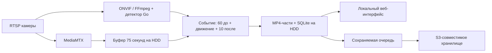

# Dozor

Домашний видеоархив для **Raspberry Pi 4 / Raspberry Pi OS Lite 64-bit**. Постоянно принимает RTSP, сохраняет движение с доступными **60 секундами предыстории и 10 секундами после**, а затем отправляет закрытые части в S3. Интерфейс на русском, работает в локальной сети и на телефоне.

Это первая реализация: программные проверки и тестовый RTSP-поток выполнены; совместимость конкретных EZVIZ, установка на ARM64 и 72 часа с четырьмя камерами требуют проверки на оборудовании. Raspberry Pi Zero в целевую платформу не входит.

## Что реализовано

- Go: управление камерами, каталог SQLite, очередь S3, HTTP API, администраторские сессии и CSRF.
- MediaMTX **1.21.1**: RTSP/TCP, переподключение, временные fMP4-фрагменты около 5 секунд.
- FFmpeg **8.0.1 в выпуске**: маленький поток для детектора и сборка MP4 без перекодирования основного видео.
- Движение: ONVIF PullPoint с проверкой фактических уведомлений; автоматический переход к локальному детектору, чувствительность и прямоугольные маски. Ошибка детектора включает временную непрерывную запись и отображается в обзоре.
- Архив событий, независимые части примерно по минуте, просмотр с HTTP Range, скачивание, фильтры камеры/даты и страницы по 200 событий.
- Онлайн-просмотр выбранной камеры через HLS: без перекодирования, с авторизацией, звуком и автоматическим переподключением.
- ext4 по UUID, systemd/udev, защита от записи в пустую точку монтирования. Форматирование не выполняется.
- Очистка при 90% до 85%: сначала выгруженные части, потом невыгруженные с фиксацией потери. Закрытые части активного события тоже участвуют в очистке.
- Сохраняемая очередь S3: один работник, ограничение скорости, повторы, стабильные ключи, Content-MD5 и проверка размера/SHA-256 metadata через HEAD.
- Подписанные Ed25519-обновления приложения и видеокомпонентов, подготовка отдельного каталога, атомарное переключение и возврат предыдущей версии при неудачной проверке запуска.



## Быстрый запуск для разработки

Нужны Go 1.26.1+, компилятор C для SQLite, FFmpeg/ffprobe и MediaMTX 1.21.1. Node.js 18+ нужен для проверок клиентского JS (`make check`, `make test`); на Raspberry и при обычном запуске он не нужен. Положите видеобинарники в `bin/` рядом с Dozor либо добавьте их в PATH.

```sh
make build
mkdir -p .state/archive
./bin/dozor serve --development \
  --config "$PWD/.state/config.json" \
  --state "$PWD/.state" \
  --socket /tmp/dozor-dev.sock \
  --archive "$PWD/.state/archive" \
  --listen 127.0.0.1:8080
```

Откройте `http://127.0.0.1:8080`. Введите код из `.state/setup-token` и придумайте пароль длиной 12–72 байта. Код одноразовый; в журнал пароль и код не выводятся. Остановка — Ctrl+C, дочерние процессы завершаются вместе с приложением.

`--development` разрешает обычный каталог, отключает автоматическую очистку по заполнению диска и требует прослушивания loopback. Для постоянной записи используйте установленную службу с проверкой ext4/UUID. Основной HTTP-порт по умолчанию 8080; внутренний RTSP-порт 8554 занят MediaMTX только на loopback.

## Установка на Raspberry Pi

1. Raspberry Pi 4, минимум 2 ГБ RAM, OS Lite 64-bit на базе Debian bookworm или новее; Ethernet, стабильное питание USB-диска, желательно ИБП. Подготовьте **существующий ext4-раздел**, который не используется системой и не смонтирован в другом месте.
2. Установите системные зависимости:

   ```sh
   sudo apt-get update
   sudo apt-get install -y ca-certificates python3 util-linux udev polkitd avahi-daemon
   sudo timedatectl set-ntp true
   ```

3. Получите или соберите ARM64-пакет по [инструкции выпуска](docs/releases.md). Публичный GitHub-репозиторий и готовый подписанный выпуск этим исходным проектом ещё не опубликованы. Для первого пакета используйте доверенный источник и проверьте подпись/хеш до установки; последующие пакеты проверяет встроенный updater.
4. Распакуйте пакет в отдельный каталог и из исходников соответствующего выпуска запустите:

   ```sh
   sudo bash scripts/install.sh /absolute/path/to/extracted-release
   sudo cat /var/lib/dozor/setup-token
   ```

5. Откройте `http://<имя-raspberry>.local:8080` или IP устройства, задайте пароль. **Настройки → Обновить список дисков → Использовать** нужный ext4-раздел. Размер и свободное место берутся из `lsblk`; для ещё не смонтированного раздела свободное место может быть неизвестно до выбора.
6. Добавьте одну камеру, проверьте событие и воспроизведение. Затем включите S3 и остальные камеры. Перед постоянной эксплуатацией выполните [приёмочные проверки](docs/acceptance.md).

Установщик создаёт отдельного пользователя `dozor`, службы, узкое правило polkit для выбора UUID-раздела и объявление HTTP-службы в Avahi. Выбор диска меняет владельца и права **корня выбранной файловой системы** на `dozor:dozor`, 0700; используйте выделенный раздел. Автоматического удаления его посторонних файлов или форматирования нет. При замене диска остановите службу, размонтируйте старый раздел и выберите новый. Для возвращающегося USB-устройства создаётся правило udev запуска того же systemd mount unit.

## Камеры и движение

**Камеры → Добавить камеру**: название, RTSP-адрес без учётных данных, логин и пароль отдельно. При включении проверяются основной и дополнительный потоки. Адреса зависят от модели: шаблон в форме — пример, а не гарантированный URL EZVIZ.

**Поиск в сети** использует ONVIF WS-Discovery в текущем сетевом сегменте. Для найденного endpoint введите учётные данные, запросите профили и назначьте основной/дополнительный поток. Поиск через VLAN и поддержку ONVIF у каждой EZVIZ нельзя предполагать. Ручное добавление остаётся доступным.

**Онлайн → Камера** или кнопка **Онлайн** в карточке камеры открывает прямую трансляцию основного потока. Можно переключать камеры, включить звук, развернуть видео и вернуться к текущему изображению кнопкой **К эфиру**. Изображение задерживается на несколько секунд; задержка зависит от GOP камеры и буфера браузера. При обрыве плеер переподключается автоматически; **Переподключить** запускает новую попытку сразу. Уход из раздела, сворачивание вкладки и выход из аккаунта прекращают загрузку видео.

Онлайн-просмотр требует включённой камеры и работающей видеослужбы с подключённым диском. Используется тот же RTSP-поток, что и для записи, без дополнительного декодирования на Raspberry. MediaMTX создаёт HLS в памяти по запросу и освобождает его через 15 секунд без зрителей. Внутренний HLS-порт 8888 слушает только loopback; браузер получает плейлисты и фрагменты через защищённый API Dozor. Браузеры с MSE используют локально встроенный hls.js; при отсутствии MSE используется нативный HLS-плеер; интернет и CDN не нужны. Для надёжной совместимости используйте H.264 и AAC либо видео без звука.

- Предпочтительный основной профиль — H.264, звук AAC либо без звука. Другие кодеки проверяются и обозначаются как зависимые от браузера; автоматического перекодирования нет. Поддержку записи конкретного набора дорожек нужно проверить реальным событием.
- Дополнительный поток — низкого разрешения и битрейта. FFmpeg декодирует его в 320×180, 5 fps, grayscale; Go сравнивает кадры с адаптивным фоном.
- `auto`: проверенные ONVIF-сигналы, иначе локальный детектор. Дополнительный поток обязателен для резервного режима. `onvif`: только камера; при ошибке — непрерывный архив до восстановления. `local`: только сравнение кадров.
- Маски задаются в долях кадра: `[{"x":0,"y":0,"w":0.2,"h":0.3}]`. Они относятся к локальному детектору; зоны ONVIF настраиваются в самой камере.
- Повторное движение в течение 10 секунд продлевает событие. После этой паузы создаётся новое; предыстории соседних событий могут пересекаться.
- Границы MP4 округляются наружу по ключевым кадрам/фрагментам. Финальная часть публикуется после закрытия последнего фрагмента; для этого оставлен запас 12 секунд. После запуска доступные 60 секунд ещё не накоплены — интерфейс помечает неполную предысторию.
- При длительном движении готовые части публикуются и отправляются по мере сборки. Детектор движения не распознаёт людей/машины и может реагировать на свет, дождь и насекомых.

## HDD, каталог и сбои

```text
/var/lib/dozor/config.json        # настройки/секреты, 0600, системный носитель
/etc/dozor/update.pub            # доверенный публичный ключ, root:root
/opt/dozor/releases/<version>/   # версии приложения и видеобинарников
/opt/dozor/current               # атомарно переключаемая ссылка
/srv/dozor/                      # только выбранный ext4 HDD
  catalog.sqlite                 # WAL/FULL; очереди и каталог
  buffer/<camera-id>/*.mp4        # технический буфер, не архив пользователя
  events/<camera-id>/<UTC-date>/<event-id>/
    event.json
    <part-id>.mp4
    <part-id>.mp4.json
    manifest.json                # описание для облака после закрытия события
```

Незавершённые `.partial` не выдаются пользователю. Sidecar-файлы содержат интервалы, контрольные суммы, пропуски и сведения об удалении. При запуске приложение сверяет каталог с файлами, завершает публикацию проверенных частей, восстанавливает задания и закрывает прерванные события с отметкой пропусков. Потерянное из-за отключения питания содержимое ещё открытого фрагмента восстановить не всегда возможно.

Перед файловыми операциями проверяется UUID/ext4/rw. Пустая точка монтирования принадлежит root и недоступна для записи пользователю приложения. При отключении HDD видеопроцессы останавливаются; интерфейс и настройки продолжают работать. При возврате диска архив открывается заново. Системная microSD не используется как запасной видеоархив.

Каталог и небольшие sidecar-описания удалённых частей остаются как история выгрузки/потерь. Видео очищается по заполнению всего выбранного раздела. Хранение буфера тоже расходует место: ориентир — суммарный битрейт × 75 секунд, плюс незакрытые/закреплённые части. Длинный GOP может увеличивать фрагменты — задайте на камере ключевой кадр примерно раз в 1–2 секунды.

## S3

Настройте endpoint (для AWS можно оставить пустым), region, bucket, уникальный prefix устройства, access/secret key и path-style для совместимого сервера. Скорость задаётся в КиБ/с, 0 — без ограничения. Секреты хранятся только в конфигурации 0600 и не возвращаются через API.

Минимальные права для отдельного префикса:

```json
{
  "Version": "2012-10-17",
  "Statement": [{
    "Effect": "Allow",
    "Action": ["s3:PutObject", "s3:GetObject"],
    "Resource": "arn:aws:s3:::YOUR_BUCKET/dozor/YOUR_DEVICE/*"
  }]
}
```

Для SSE-KMS нужны соответствующие разрешения KMS. Совместимый сервер должен поддерживать SigV4, Content-MD5, HEAD, Content-Length и пользовательские metadata. HEAD использует разрешение GetObject. Приватный бакет и TLS — штатная конфигурация; публичный доступ не требуется.

Ключи соответствуют `prefix/events/...`. Повтор передачи использует тот же ключ, проверяя размер и SHA-256 metadata; сервер проверяет MD5 тела PUT. ETag не трактуется как контрольная сумма. Полная отметка события появляется только после всех частей и `manifest.json`. После потери невыгруженной части событие не объявляется полностью сохранённым в облаке. Если поменять endpoint/bucket/prefix, доступные локальные части ставятся в очередь для нового назначения; отсутствующие локально части перенести автоматически невозможно.

Dozor не вызывает удаление объектов. Например, **отдельно** настройте в консоли S3 lifecycle-правило для префикса устройства: expiration через 30 дней, а при versioning — также срок удаления noncurrent versions. Подберите срок и стоимость под свой объём. Поток 1 Мбит/с даёт около 10.8 ГБ/сутки при постоянной записи; частые движения приближают архив к этому объёму.

При отсутствии сети запись продолжается, задания остаются в SQLite, задержка повторов растёт до ~17 минут. При заполнении HDD возможна удалённая до выгрузки запись: это явно видно в журнале и событии. Текущий интерфейс воспроизводит локальные файлы; скачивание из S3 обратно в интерфейс не входит в эту версию.

## Доступ и обслуживание

Одна учётная запись администратора, bcrypt, сессии 12 часов, HttpOnly/SameSite-cookie, CSRF для изменения данных, ограничение попыток входа. После перезапуска сессии сбрасываются. Открывать RTSP/API/интерфейс напрямую в интернет не нужно. Для недоверенной сети используйте VPN или TLS (`tls_cert`/`tls_key` в конфигурации и перезапуск службы); встроенный сервер помечает cookie Secure при HTTPS. По умолчанию локальный HTTP не шифрует транспорт.

```sh
sudo systemctl status dozor
sudo journalctl -u dozor --since today
sudo journalctl -u dozor-update --since today
sudo systemctl restart dozor
sudo systemctl start dozor-update.service
```

Для восстановления забытого пароля: остановите службу, удалите только `password_hash` из `/var/lib/dozor/config.json`, запустите службу и используйте новый `/var/lib/dozor/setup-token`. Сохраняйте права файла 0600. Резервная копия настроек содержит секреты; храните её отдельно от видеобакета.

Обновляются только Dozor, MediaMTX и FFmpeg. Linux и прошивки камер обновляются отдельно. Подробнее: [выпуски и откат](docs/releases.md), [HTTP API и устройство кода](docs/architecture.md), [проверки и ограничения](docs/acceptance.md).

## Разработка и тесты

```sh
make test                 # Go + race detector
make check                # vet, gofmt, JS, shell, Python
make build
DOZOR_MEDIAMTX="$PWD/bin/mediamtx" make integration
```

Интеграционный тест занимает около двух минут. Нужен FFmpeg с `libx264` для создания тестового потока (в production bundle этот тестовый encoder не нужен). Порты 8554 и 18554 должны быть свободны. Тест сам запускает/останавливает два MediaMTX и FFmpeg и удаляет временные данные. Приложение и тесты не должны работать одновременно на одном порту.

Стек и внешние протоколы: [MediaMTX recording](https://mediamtx.org/docs/features/record), [FFmpeg](https://ffmpeg.org/documentation.html), [поддержка ONVIF EZVIZ](https://support.ezviz.com/faq/article/Whether-EZVIZ-devices-support-ONVIF-protocol), [ONVIF Profile G](https://www.onvif.org/profiles/profile-g/). Внутренний архив камеры и Profile G в эту версию не входят.
